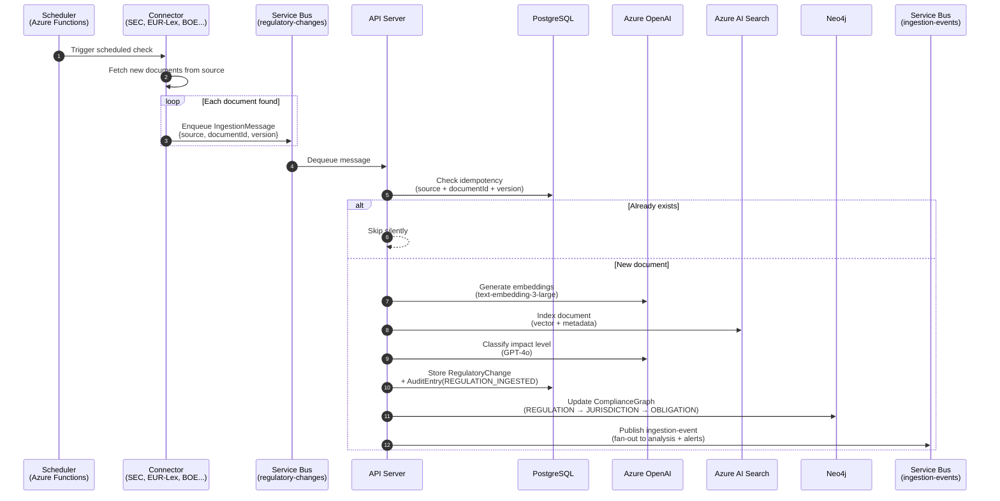
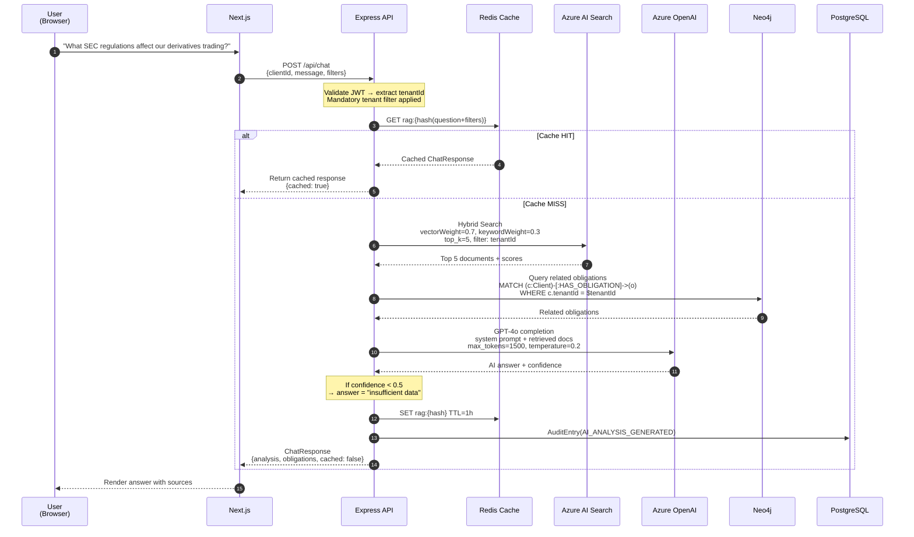
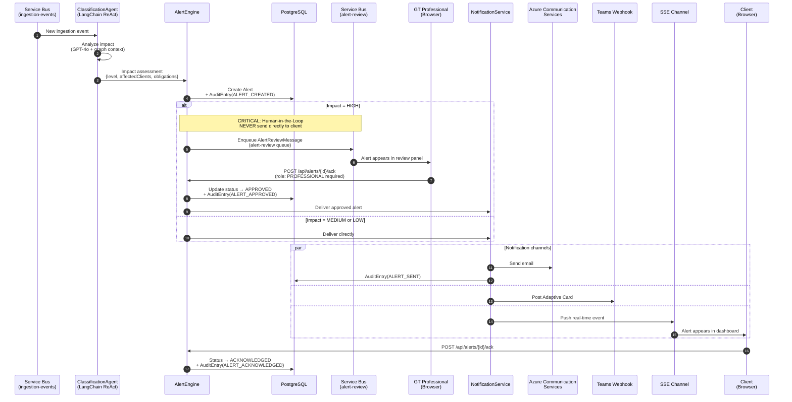
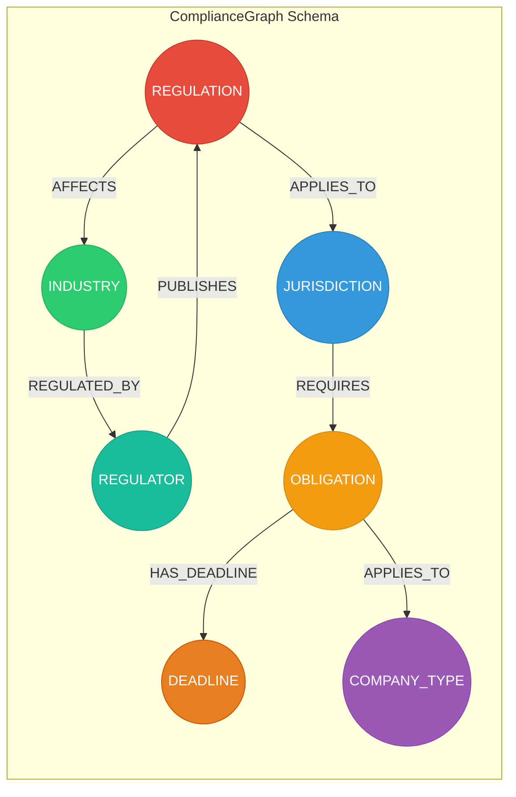
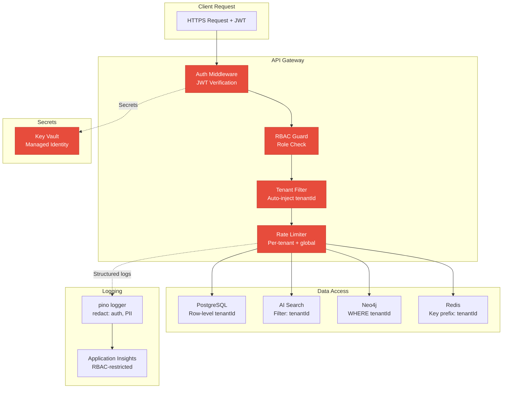

# RegWatch AI — Architecture

## System Overview

RegWatch AI is a regulatory monitoring platform for Grant Thornton built on
Azure-first infrastructure. It ingests regulatory changes from multiple
international sources, analyzes them with AI, maps obligations to clients
via a knowledge graph, and delivers alerts through a Human-in-the-Loop
review process.

---

## High-Level Architecture

```mermaid
graph TB
    subgraph "Clients"
        BROWSER[Browser]
    end

    subgraph "Frontend — Azure Container Apps"
        WEB["Next.js 14<br/>App Router<br/>(ca-web)"]
    end

    subgraph "Backend — Azure Container Apps"
        API["Express API<br/>TypeScript strict<br/>(ca-api)"]
    end

    subgraph "AI & Search"
        AOAI["Azure OpenAI<br/>GPT-4o<br/>text-embedding-3-large"]
        AIS["Azure AI Search<br/>Hybrid Vector+BM25<br/>Semantic Ranker"]
    end

    subgraph "Data Stores"
        PG["PostgreSQL 16<br/>Prisma ORM"]
        NEO4J["Neo4j 5<br/>ComplianceGraph"]
        REDIS["Azure Cache for Redis<br/>RAG · Embeddings · Throttle"]
    end

    subgraph "Messaging"
        SB["Azure Service Bus<br/>Queues + Topics"]
    end

    subgraph "Observability"
        INSIGHTS["Application Insights<br/>+ Log Analytics"]
    end

    subgraph "Security"
        KV["Azure Key Vault"]
    end

    BROWSER -->|HTTPS + JWT| WEB
    WEB -->|REST API| API
    API --> AOAI
    API --> AIS
    API --> PG
    API --> NEO4J
    API --> REDIS
    API --> SB
    API -.->|Secrets| KV
    API -.->|Logs + Metrics| INSIGHTS

    classDef azure fill:#0078d4,stroke:#005a9e,color:#fff
    classDef graph fill:#008cc1,stroke:#006a94,color:#fff
    classDef frontend fill:#10b981,stroke:#059669,color:#fff

    class AOAI,AIS,PG,REDIS,SB,INSIGHTS,KV azure
    class NEO4J graph
    class WEB frontend
```

---

## Flow 1 — Regulatory Ingestion

New regulatory documents are discovered, processed, and indexed.



**Key rules applied:**
- Idempotency: `source + documentId + version` checked in PostgreSQL before any processing
- SEC EDGAR rate limit: max 10 req/s with exponential backoff via Redis throttle
- Audit trail: every ingested regulation logged as `REGULATION_INGESTED`

---

## Flow 2 — RAG Query (Chat)

User asks a natural language compliance question.



**Key rules applied:**
- Redis cache checked FIRST (key: hash of question + filters, TTL 1h)
- Hybrid search: vector 0.7 + BM25 keyword 0.3, top_k=5
- Azure OpenAI: max_tokens=1500, temperature=0.2
- Confidence < 0.5 → return `"insufficient data"` — never fabricate
- Tenant isolation: all queries filtered by `tenantId` from JWT
- Audit: every AI analysis logged

---

## Flow 3 — Alert Pipeline (HITL)

Regulatory change triggers alert with mandatory Human-in-the-Loop for HIGH impact.



**Key rules applied:**
- HIGH impact → mandatory GT Professional review before client notification
- Alert status machine: `PENDING_REVIEW → APPROVED → SENT → ACKNOWLEDGED`
- HITL approval requires role `PROFESSIONAL` — enforced by RBAC middleware
- Three notification channels: Email (Azure Communication Services), Teams (Adaptive Cards), SSE (in-app)
- Full audit trail: ALERT_CREATED → ALERT_APPROVED → ALERT_SENT → ALERT_ACKNOWLEDGED

---

## Knowledge Graph — ComplianceGraph (Neo4j)



### Node types

| Node | Key Properties | Example |
|------|---------------|---------|
| `REGULATOR` | name, country, website | SEC (US), CNBV (MX), CVM (BR) |
| `REGULATION` | title, sourceId, impactLevel, effectiveDate | "SEC Rule 10b-5 Amendment" |
| `JURISDICTION` | code (ISO 3166), name, region | US, BR, ES, MX, AR, CL |
| `INDUSTRY` | name, sectorCode | Banking, Insurance, Securities |
| `COMPANY_TYPE` | name | Public Company, Financial Institution |
| `OBLIGATION` | title, status, deadline, priority | "File quarterly derivatives report" |
| `DEADLINE` | date, type (hard/soft), penaltyInfo | 2026-06-30, hard, "$50K/day fine" |

### Key relationships

| Relationship | From → To | Purpose |
|-------------|-----------|---------|
| `PUBLISHES` | Regulator → Regulation | Track origin of regulatory changes |
| `APPLIES_TO` | Regulation → Jurisdiction | Geographic scope |
| `AFFECTS` | Regulation → Industry | Industry impact mapping |
| `REQUIRES` | Jurisdiction → Obligation | What must be done where |
| `HAS_DEADLINE` | Obligation → Deadline | Time constraints |
| `APPLIES_TO` | Obligation → CompanyType | Who must comply |
| `REGULATED_BY` | Industry → Regulator | Oversight mapping |

### Onboarding query (ComplianceMap generation)

When a new client is created, the onboarding service builds their
ComplianceMap by traversing the graph:

```cypher
// Find all obligations for a client based on their countries + industries
MATCH (j:JURISDICTION)<-[:APPLIES_TO]-(r:REGULATION)-[:AFFECTS]->(i:INDUSTRY)
WHERE j.code IN $clientCountries
  AND i.name IN $clientIndustries
WITH r, j
MATCH (j)-[:REQUIRES]->(o:OBLIGATION)-[:APPLIES_TO]->(ct:COMPANY_TYPE)
WHERE ct.name = $clientCompanyType
RETURN o, r, j
```

---

## Data Lineage

Full traceability from source document to client alert:

```
Regulatory Source → RegulatoryChange → AIAnalysis → Obligation → Client → Alert
         │                  │                │            │           │
         └── AuditEntry ────┴── AuditEntry ──┴─ AuditEntry┴─ AuditEntry
             (INGESTED)        (ANALYSIS)       (CREATED)    (SENT/ACK)
```

---

## Security Architecture



**Tenant isolation enforced at every layer:**

| Layer | Mechanism |
|-------|-----------|
| API Middleware | JWT `tenantId` claim auto-injected into all queries |
| PostgreSQL | `WHERE tenant_id = $tenantId` on every query (Prisma middleware) |
| AI Search | `$filter=tenantId eq '{tenantId}'` on every search |
| Neo4j | `WHERE n.tenantId = $tenantId` on every Cypher query |
| Redis | Key prefix `{tenantId}:rag:...` |
| Logs | pino redact: `authorization`, `apiKey`, `password`, `token`, `email` |

---

## Infrastructure (Azure)

| Resource | Service | SKU (dev/prod) | Purpose |
|----------|---------|----------------|---------|
| `oai-regwatch-*` | Azure OpenAI | S0 | GPT-4o (30K TPM) + embeddings (120K TPM) |
| `srch-regwatch-*` | Azure AI Search | Basic / Standard | Hybrid vector + BM25 |
| `redis-regwatch-*` | Azure Cache for Redis | Basic C1 / Standard C2 | RAG cache, embeddings, throttle |
| `pg-regwatch-*` | PostgreSQL Flexible | B1ms / D2ds_v4 | Relational data, Prisma |
| `sb-regwatch-*` | Azure Service Bus | Standard | Queues + topics for async |
| `kv-*` | Key Vault | Standard | All secrets |
| `ai-regwatch-*` | Application Insights | Per-GB | Monitoring + logs |
| `acr*` | Container Registry | Basic / Standard | Docker images |
| `cae-regwatch-*` | Container Apps Env | Consumption | Serverless containers |
| `ca-api-*` | Container App | 0.5 CPU / 1Gi | API with KEDA scaling |
| `ca-web-*` | Container App | 0.25 CPU / 0.5Gi | Next.js frontend |
